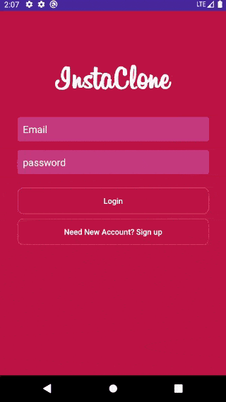
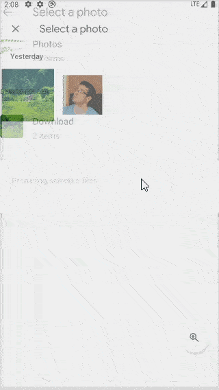

# InstaClone_Kotlin_MVVM
 An instagram app clone for android

## Description 
 An instagram app clone that implements MVVM architectural pattern using Kotlin as frontend and Firebase as backend.
 This app uses Hilt for dependency injection and Coroutines to execute asynchronous firebase operations.

### Features
- User registration and login
- Search for users
- View users profile screen
- Follow or Unfollow a user
- Post an image from gallery or camera
- Post feed based on who you follow
- Like a post or remove your like
- Comment on posts and view all comments of a post
- Edit your profile information

## Preview

## Online Emulator
[Open app in appetize.io](https://appetize.io/app/tm4jwy8kcntm7ccx8krngbweqw?device=pixel4&scale=75&orientation=portrait&osVersion=10.0 "InstaClone")

- **Please do not spam the app**
- You can login with this email and password
    - Email: **test@test.test**
    - Password: **test1234**
- Or you can register a new user

## Components used in the application
- AndroidViewModel
- Hilt
- Coroutines
- LiveData
- Kotlin
- AndroidX
- Firebase Auth, Database, Storage
- [CircleImageView](https://github.com/hdodenhof/CircleImageView "CircleImageView")
- [Android-Image-Cropper](https://github.com/ArthurHub/Android-Image-Cropper "Android-Image-Cropper")
- [Picasso](https://github.com/square/picasso "picasso")
    - Image loading and caching from internet

## Upcoming feature
- Data caching for offline use with the help of ROOM
- Deleting posts and comments
- Chat
- More animation for ui

## Opening the app in Android studio
To build this app source code in your Android studio you need to put your "google-services.json" firebase config file to app folder

# Licence

    Copyright 2021 Hamed Vakhide
    
    Licensed under the Apache License, Version 2.0 (the "License");
    you may not use this file except in compliance with the License.
    You may obtain a copy of the License at
    
        http://www.apache.org/licenses/LICENSE-2.0
    
    Unless required by applicable law or agreed to in writing, software
    distributed under the License is distributed on an "AS IS" BASIS,
    WITHOUT WARRANTIES OR CONDITIONS OF ANY KIND, either express or implied.
    See the License for the specific language governing permissions and
    limitations under the License.

